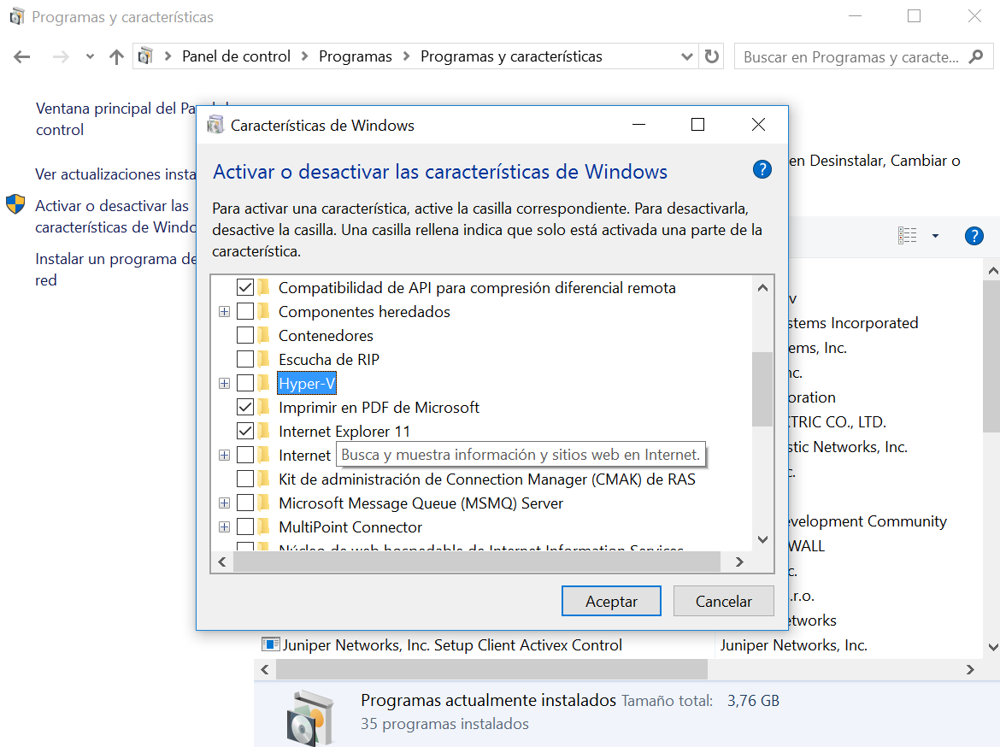
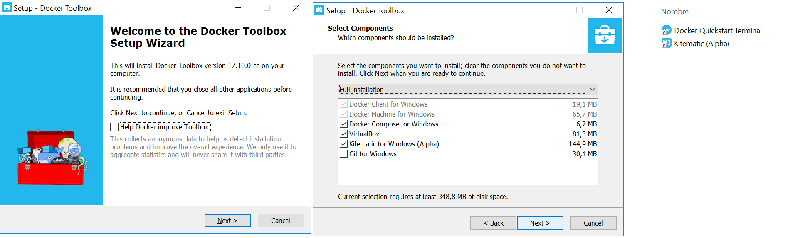
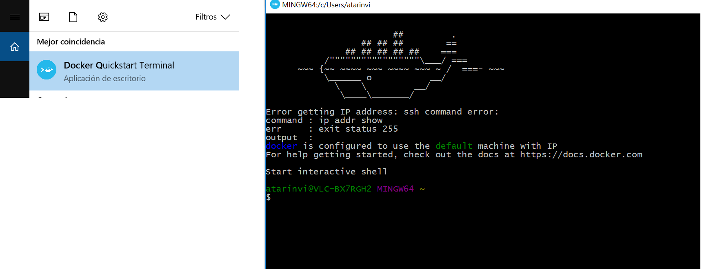
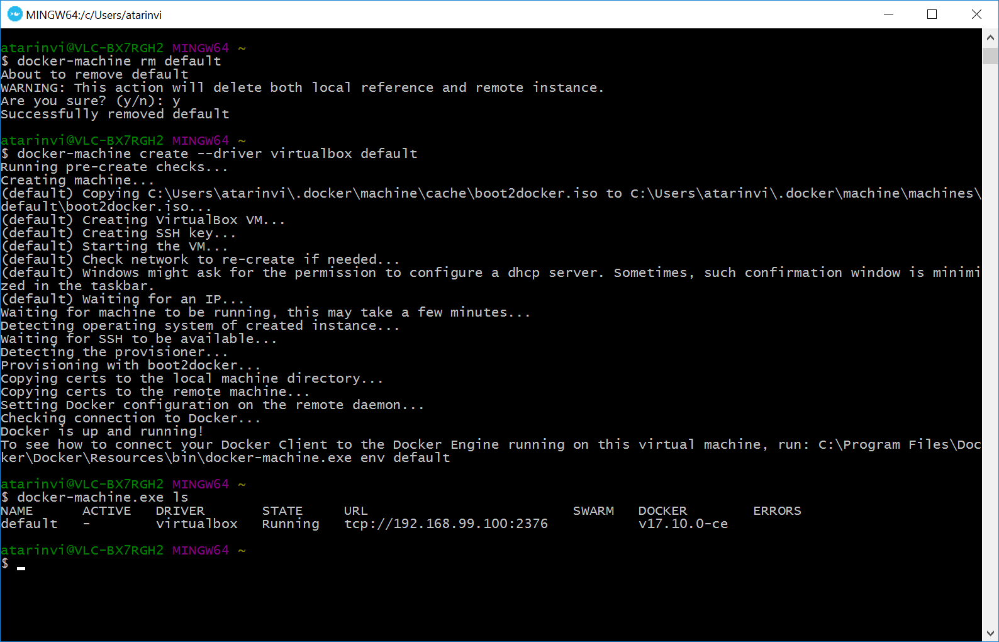
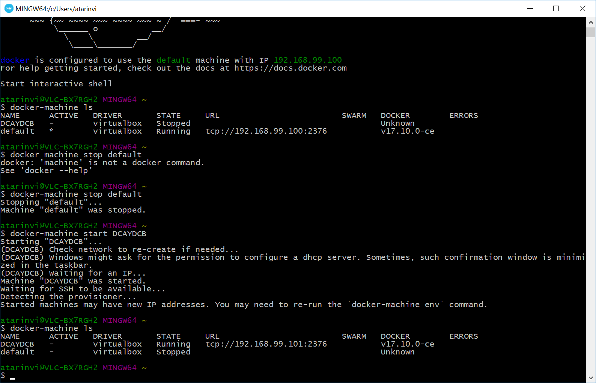

# Steps to prepare the laboratory on a Windows 7 laptop

 In this section we cover only the installation of Docker Quickstart Tools in Windows 7.

 For Windows 8 versions and up we recommend using Docker For Windows installation instead
 of Docker QuickStart Tools.

 - Install Git on your pc following the [installation guide](https://git-scm.com/)

 - [Install VirtualBox](http://www.virtualbox.org/):

    1) [Download the installer](http://download.virtualbox.org/virtualbox/5.2.0/VirtualBox-5.2.0-118431-Win.exe),
       start it up and follow the steps.

    2) Download VirtualBox [extension pack](http://download.virtualbox.org/virtualbox/5.2.0/Oracle_VM_VirtualBox_Extension_Pack-5.2.0-118431.vbox-extpack)
       and open it with VirtualBox

    3) If your operating system is Windows 8 o Windows 10 and you've decided to use Docker QuickStart
       instead of Docker for Windows then you will need to disable Hiper-V to prevent collisions:

    

 - Install Docker ToolBox:

    1) [Installl Docker Toolbox](https://download.docker.com/win/stable/DockerToolbox.exe)

    

 - Once our software is ready, we proceed creating a VirtualBox machine:

    1) Launch Docker Quickstart:

    

    2) From Docker Quickstart, replace "default" machine by our own one:

    

    Once deleted, create our own virtual machine:

        $ docker-machine create --driver virtualbox --virtualbox-memory 8000 DCAYDCB
        Running pre-create checks...
        Creating machine...
        (DCAYDCB) Copying C:\Users\atarinvi\.docker\machine\cache\boot2docker.iso to C:\Users\atarinvi\.docker\machine\machines\DCAYDCB\boot2docker.iso...
        (DCAYDCB) Creating VirtualBox VM...
        (DCAYDCB) Creating SSH key...
        (DCAYDCB) Starting the VM...
        (DCAYDCB) Check network to re-create if needed...
        (DCAYDCB) Waiting for an IP...
        Waiting for machine to be running, this may take a few minutes...
        Detecting operating system of created instance...
        Waiting for SSH to be available...
        Detecting the provisioner...
        Provisioning with boot2docker...
        Copying certs to the local machine directory...
        Copying certs to the remote machine...
        Setting Docker configuration on the remote daemon...
        Checking connection to Docker...
        Docker is up and running!
        To see how to connect your Docker Client to the Docker Engine running on this virtual machine, run: C:\Program Files\Docker\Docker\Resources\bin\docker-machine.exe env DCAYDCB

    We can check the status of our machine using this command:

        $ docker-machine.exe ls
        NAME      ACTIVE   DRIVER       STATE     URL                         SWARM   DOCKER        ERRORS
        DCAYDCB   *        virtualbox   Running   tcp://192.168.99.101:2376           v17.10.0-ce

  ***Booting Windows environments where Docker QuickStart is installed***

   If you want to use Docker Quickstart instead of Docker ToolBox to boot your machine, here you have
   the steps to do this.

   1) Open a Docker Quickstart window and start the virtual machine that we are using for the
   laboratory, DCAYDCB:

 

  2) Load the environment variables to interact with your lab:

            $ eval $(docker-machine.exe env DCAYDCB)

  4) Go tho the "docker/windows" folder of your disk where you have downloaded this github repo
    and start it. Windows is much more slow than Linux start:

 

            $ cd ~/scripts
            $ ./LABORATORIOWINDOWS.sh iniciar

  - ***Stop the lab***

  1) Go to the "scripts" folder and stop it:

            $ cd ~/scripts
            $ ./LABORATORIOWINDOWS.sh parar