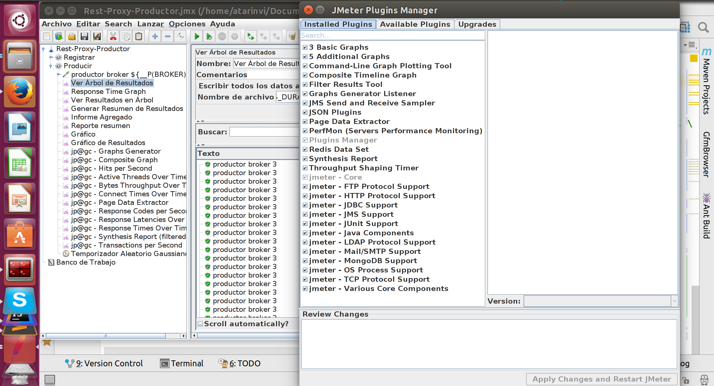

# Kafka Docker Cluster Workshop

# Table Of Contents
1. [Document objective](#1-document-objective)
2. [Hardware Requirements](#2-hardware-requirements)
3. [Software Requirements](#3-software-requirements)
4. [Exercises](#4-exercises)

4.1. [Starting and Stopping your laboratory](##4-1-starting-and-stopping-your-laboratory)

4.2. [Messaging Tests](##4-2-messaging-tests)

4.2.1. [Publish-Subscribe messaging using command line Kafka scripts](###4-2-1-publish-subscribe-messaging-using-command-line-kafka-scripts)

4.2.2. [MirrorMaker message replication between clusters](###4-2-2-mirrormaker-replication-between-clusters)

4.2.3. [Enterprise Replicator message replication between clusters](###4-2-3-enterprise-replicator-replication-between-clusters)

4.2.4. [JMeter stress tests](###4-2-4-jmeter-stress-tests)

4.2.4.1. [LINEA BASE PRODUCTOR ONLINE](####4-2-4-1-linea-base-productor-online)

4.2.4.2. [LINEA_BASE_PRODUCTOR_BULK_ONLINE](####4-2-4-2-linea-base-productor-bulk-online)
             
4.2.4.3. [LINEA_BASE_PRODUCTOR_BULK_CONNECT](####4-2-4-3-linea-base-productor-bulk-connect)

4.2.4.4. [LINEA_BASE_CONSUMIDOR_ONLINE](####4-2-4-4-linea-base-consumidor-online) 

4.2.4.5. [PRODUCTOR_PICOS](####4-2-4-5-productor-picos)

4.2.4.6. [PRODUCTOR_INCREMENTAL](####4-2-4-6-productor-incremental)

## 1 Document objective

 Following the steps of this workshop will give you a full Kafka cluster lab to run in your laptop.
 This is the architecture that you may expect to have built and tested after you have completed them:

 Let's go for it!

## 2 Hardware Requirements

 The minimum hardware requirements are:

   - 16 Gb RAM (8 GB could be too low)
   - 30 GB disk

## 3 Software Requirements

 In order to follow the exercises in this tutorial we will need to install in our laptop
 Docker, Docker Compose and JMeter.

 ***[Windows 7 laptops](./InstalarEnWindows7.md)***, install Docker, Docker Compose and VirtualBox

 ***[Ubuntu laptops](./InstalarEnUbuntu.md)***, install Docker and Docker Compose.

## 4 Exercises

 This is our Git project structure, clone it in your laptop and open it with your prefered IDE. I've used
 IntelliJ:

    ~/ $ tree
    .
    └── Workshop
        ├── docker
        │   ├── linux
        │   │   ├── db2elkmysql.yml
        │   │   ├── docker-compose-generico.yml
        │   │   ├── kafka-connect.yml
        │   │   ├── kafka-rest.yml
        │   │   ├── replicator.yml
        │   │   ├── schema-registry.yml
        │   │   └── zk-kafka.yml
        │   └── windows
        │       ├── docker-compose-1.yml
        │       ├── docker-compose-2.yml
        │       ├── docker-compose-3.yml
        │       ├── docker-compose.yml
        │       ├── inicio.sh
        │       └── parada.sh
        └── scripts
            ├── randomly_putdown_machines.sh
            ├── config
            │   ├── consumerdatacenterb.properties
            │   ├── createDB2sampleDB.sh
            │   ├── db2jcc4.jar
            │   ├── db2jcc.jar
            │   ├── db2jcc_license_cu.jar
            │   ├── LABORATORIO.conf
            │   ├── producerdatacenterb.properties
            │   ├── source-quickstart-db2.properties
            │   └── traefik.toml
            ├── enterprisereplicator.sh
            ├── LABORATORIO.sh
            ├── mirrormaker.sh
            ├── Rest-Proxy-Consumidor.jmx
            ├── Rest-Proxy-Productor.jmx
            └── testJmeter.sh

### 4-1 Starting and Stopping your laboratory

  You'll find the "scripts" folder, and there the LABORATORIO.sh script. This uses a config
  file called LABORATORIO.conf. This will help you to tweak your lab, adding or removing racks,
  nodes, changing docker image versions and forwarding to different ports.

  ***Config file content***

        $ cat config/LABORATORIO.conf

        DOCKER_COMPOSE_ZK_KAFKA          ../docker/linux/zk-kafka.yml
        DOCKER_COMPOSE_SCHEMA_REGISTRY   ../docker/linux/schema-registry.yml
        DOCKER_COMPOSE_KAFKA_CONNECT     ../docker/linux/kafka-connect.yml
        DOCKER_COMPOSE_KAFKA_REST        ../docker/linux/kafka-rest.yml
        DOCKER_COMPOSE_REPLICATOR        ../docker/linux/replicator.yml
        DOCKER_COMPOSE_DB2_ELK_MYSQL     ../docker/linux/db2elkmysql.yml
        INDICE_REPLICACION_DATACENTER    2
        NODOS_REPLICATOR                 1
        CP_VERSION                       latest
        ZOOKEEPER_PORT                   2181
        ZOOKEEPER_INTERNAL_PORT_1        22888
        BROKER_PORT                      9092
        CONNECT_PORT                     8083
        REST_PORT                        8082
        REGISTRY_PORT                    8081
        REPLICATOR_PORT                  8083
        REST_BINDING_PORT                1882
        REGISTRY_BINDING_PORT            1771
        CONNECT_BINDING_PORT             1553
        REPLICATOR_BINDING_PORT          1993
        REINICIAR                        on-failure:1
        RED                              confluent-network

  ***Start, stop, check and reset our lab's containers***

     $ ./LABORATORIO.sh

        Use:

        ./LABORATORIO.sh iniciar [dc1|todoslosdatacenter] <db2> <elastic> <kibana> <mysql> <oracle>

        ./LABORATORIO.sh verificar

        ./LABORATORIO.sh parar <bd|dc2|todo>

        ./LABORATORIO.sh borrar

         []: indica que es obligatorio elegir. Por ejemplo, "iniciar" requerirá indicar si vamos a iniciar únicamente
         dc1 o si vamos a iniciar todos los datacenter.

         <> indica que es opcional poner o no el valor. Por ejemplo, si sólo queremos arrancar elastic y kibana no
         es necesario pasar el resto de parámetros (db2, mysql, oracle)

          * 'dc1' se refiere a los contenedores del rac principal, excepto los de persistencia de datos.
          * 'todoslosdatacenter' se refiere a todos los datacenter del laboratorio.
          * 'db2' arranca un contenedor de db2.
          * 'elastic' arranca un contenedor de Elasticsearch.
          * 'kibana' arranca un contenedor de Kibana.
          * 'mysql' arranca un contenedor de MySql.
          * 'oracle' arranca un contenedor de Oracle XE.

   ***start our lab*** use the 'iniciar' parameter, followed by what you want to start.
   If you i.e. want to launch the main datacenter and a db2 datacenter, run this command:

        $ ./LABORATORIO.sh iniciar dc1 db2

   To start all the datacenter indicated in the INDICE_REPLICACION_DATACENTER config parameter and y ELK:

        $ ./LABORATORIO.sh iniciar todoslosdatacenter elastic kibana

   ***Stop your lab*** use 'parar' as first parameter, and next say what you want to stop.

   If you i.e. want to stop secondary datacenter dc2, use this:

     $ ./LABORATORIO.sh parar dc2

   If you want to stop all the persistency containers, use this:

     $ ./LABORATORIO.sh parar bd

   If you want to stop everything, use this:

     $ ./LABORATORIO.sh parar todo

   ***Verify*** what's going on with your lab machines using this parameter:

     $ ./LABORATORIO.sh verificar

   ***Reset*** your lab to the initial state cleaning temporary archives and removing topics. This will set
   your lab ootb, wiping out any trace of modifications, broken files, full disks, machines not starting ...:

     $ ./LABORATORIO.sh borrar

### 4-2 Messaging Tests

  Let's launch a few messaging tests:

     - Sending and consuming messages from a topic using the Kafka commands
     - Replica between clusters with MirrorMaker
     - Enterprise Replicator message replication between clusters
     - JMeter stress tests

### 4-2-1 Publish-Subscribe messaging using command line Kafka scripts

 Our first test is to make sure through the scripts provided by Kafka, that the three brokers in our lab's cluster
 do really work in cluster mode.

  For this we will use:

    - the "kafka-topics" command, to create a topic,
    - the "kafka-console-producer" command, to send messages from one of the brokers to the topic itself,
    - the "kafka-console-consumer" command, to pull messages from the topic, using any of the three brokers as a source.

 ***We will follow these steps***

    1) Open four Linux terminals

    2) From one of the terminals, create a topic

         docker@docker:~$ docker exec -it dc1_kafka-1_1 \
                                    kafka-topics --create \
                                   --zookeeper dc1_zookeeper-1_1:2181,dc1_zookeeper-2_1:2181,dc1_zookeeper-3_1:2181  \
                                   --replication-factor 3 --partitions 2 --topic pruebaencluster

       Command result will be:

         Created topic "pruebaencluster".

    3) Then, check about the topic. In order to test the cluster use a different node from the one that we created the topic.
       In this example, we are using dc1_kafka-3_1 to create it:

         docker@docker:~$ docker exec -it dc1_kafka-3_1 \
             kafka-topics --describe --topic pruebaencluster \
             --zookeeper dc1_zookeeper-1_1:2181,dc1_zookeeper-1_1:2181,dc1_zookeeper-1_1:2181

       Command will return this:

         Topic:pruebaencluster	PartitionCount:2	ReplicationFactor:3	Configs:
         Topic: pruebaencluster	Partition: 0	Leader: 2	Replicas: 2,1,3	Isr: 2,1,3
         Topic: pruebaencluster	Partition: 1	Leader: 3	Replicas: 3,2,1	Isr: 3,2,1

    4) Next, open a producer from a terminal:

         docker@docker:~$ docker exec -it dc1_kafka-3_1 \
                     kafka-console-producer \
                    --broker-list dc1_kafka-1_1:9092,dc1_kafka-2_1:9092,dc1_kafka-3_1:9092 \
                    --topic pruebaencluster

       then write three messages on it, to send them to the topic

         mensaje 1
         mensaje 2
         mensaje 3

    5) Finally, use three different terminals, one for each broker in the Kafka cluster, and consume
       the messages that we have sent to the topic:

         docker@docker:~$ docker exec -it dc1_kafka-1_1 \
                                kafka-console-consumer \
                                --bootstrap-server dc1_kafka-1_1:9092,dc1_kafka-2_1:9092,dc1_kafka-3_1:9092 \
                                --topic pruebaencluster --from-beginning

         docker@docker:~$ docker exec -it dc1_kafka-2_1 \
                                kafka-console-consumer \
                                --bootstrap-server dc1_kafka-1_1:9092,dc1_kafka-2_1:9092,dc1_kafka-3_1:9092 \
                                --topic pruebaencluster --from-beginning

         docker@docker:~$ docker exec -it dc1_kafka-3_1 \
                                kafka-console-consumer \
                                --bootstrap-server dc1_kafka-1_1:9092,dc1_kafka-2_1:9092,dc1_kafka-3_1:9092 \
                                --topic pruebaencluster --from-beginning

    All the three consumer windows will return the three messages that we inserted earlier in the topic:

        mensaje 2
        mensaje 1
        mensaje 3
        Processed a total of 3 messages

### 4-2-2 MirrorMaker message replication between clusters

  To carry out the MirrorMaker tests we have provided the mirrormaker.sh script, located in the "scripts" folder
  from the Git repository. The script is self-descriptive:

      $ ./mirrormaker.sh
    
       Use:

       Start MirrorMaker from a terminal with this parameter

       $ ./mirrormaker.sh iniciarmirrormaker

       Then, open a new terminal and produce keyed messages in the primary datacenter with this command

       $ ./mirrormaker.sh producir SinClave <nummensajes>

       or use this to produce the messages without key

       $ ./mirrormaker.sh producir ConClave <nummensajes>

       Open a new window and consume from the secondary datacenter the messages that has been replicated by
       MirrorMaker from the primary with this command:

       $ ./mirrormaker.sh consumir dc2
 
 ***We verify the operation of MirrorMaker following these steps:***

 1) Make sure to have all the datacenter started using this command:
 
    $ ./LABORATORIO.sh iniciar todoslosdatacenter 
 
 2) Next, start MirrorMaker:

         docker@docker:~/scripts$ ./mirrormaker.sh iniciarmirrormaker

 2) Next, start a message consumer from the topic in the primary datacenter's Kafka cluster:

         docker@docker:~/scripts$ ./mirrormaker.sh consumir dc1

    Screen will be waiting for messages to arrive. It will start printing them as soon as we
    launch the producer command in step 4)
    
 3) Next, start a message consumer from the topic in the secondary datacenter's Kafka cluster, where MirrorMaker
    should be replicating the messages as soon as they're inserted in the next step:

         docker@docker:~/scripts$ ./mirrormaker.sh consumir dc2

    Screen will also be still, waiting for messages

 4) Start producing messages from a new terminal. If you want them to be unkeyed use this command:
    
         docker@docker:~/scripts$ ./mirrormaker.sh producir SinClave <nummensajes>

    If you want them keyed, use that one:
    
         docker@docker:~/scripts$ ./mirrormaker.sh producir ConClave <nummensajes>

    Once the script has inserted the messages in the topic, we will begin to see them in the previous
    consumer windows that we opened in steps 2) and 3):

         docker@docker:~/scripts$ ./mirrormaker.sh consumir dc1

            CreateTime:1508763949172	9971
            CreateTime:1508763949172	9974
            CreateTime:1508763949173	9977
            CreateTime:1508763949173	9980
            CreateTime:1508763949173	9983
            CreateTime:1508763949173	9986
            CreateTime:1508763949173	9989
            CreateTime:1508763949174	9992
            CreateTime:1508763949174	9995
            CreateTime:1508763949174	9998
            ^CProcessed a total of 10000 messages

         docker@docker:~/scripts$ ./mirrormaker.sh consumir dc2
            CreateTime:1508763949172	9971
            CreateTime:1508763949172	9974
            CreateTime:1508763949173	9977
            CreateTime:1508763949173	9980
            CreateTime:1508763949173	9983
            CreateTime:1508763949173	9986
            CreateTime:1508763949173	9989
            CreateTime:1508763949174	9992
            CreateTime:1508763949174	9995
            CreateTime:1508763949174	9998
            ^CProcessed a total of 10000 messages

### 4-2-3 Enterprise Replicator message replication between clusters

 To carry out the Enterprise Replicator tests we have provided with the enterprisereplicator.sh script,
 located in the "scripts" folder of the Git repository.

 Launching it without parameters is self-descriptive:

        $ ./enterprisereplicator.sh***

         Forma de uso:

         $ ./enterprisereplicator.sh iniciarenterprisereplicator
         $ ./enterprisereplicator.sh producir SinClave <nummensajes>
         $ ./enterprisereplicator.sh producir ConClave <nummensajes>
         $ ./enterprisereplicator.sh consumir dc1
         $ ./enterprisereplicator.sh consumir dc2

 ***Testing steps for Enterprise Replicator:***

 1) Make sure all the datacenters are up and running:
 
        docker@docker:~/scripts$ ./LABORATORIO.sh iniciar todoslosdatacenter 

 2) Run a consumer in the main datacenter:

         docker@docker:~/scripts$ ./enterprisereplicator.sh consumir dc1

    This will be in standby, waiting to receive messages. We will create them in step 4)

 3) Run a consumer in the secondary datacenter:

         docker@docker:~/scripts$ ./enterprisereplicator.sh consumir dc2

    This will also be in standby, waitiing to receive the messages that Enterprise Replicator
    will be transfering from topic in the main datacenter Kafka cluster to the secondary
    datacenter Kafka cluster

 4) Launch the "enterprisereplicator.sh" script with the parameters "producir", "SinClave" or "ConClave"
    depending on whether you want the messages to be generated keyed or un-keyed, and a number of messages.

         docker@docker:~/scripts$ ./enterprisereplicator.sh producir SinClave <nummensajes>
   or
         docker@docker:~/scripts$ ./enterprisereplicator.sh producir SinClave <nummensajes>
 
 
  Once the script starts inserting the messages in the main datacenter Kafka cluster's topic, we will
  see them in the windows of the consumer commands that we opened in steps 2) and 3):

         docker@docker:~/scripts$ ./enterprisereplicator.sh consumir dc1

            CreateTime:1508769524228	19981
            CreateTime:1508769524228	19984
            CreateTime:1508769524228	19987
            CreateTime:1508769524228	19990
            CreateTime:1508769524228	19993
            CreateTime:1508769524228	19996
            CreateTime:1508769524228	19999
            ^CProcessed a total of 6667 messages

         docker@docker:~/scripts$ ./enterprisereplicator.sh consumir dc2

            CreateTime:1508769524228	19981
            CreateTime:1508769524228	19984
            CreateTime:1508769524228	19987
            CreateTime:1508769524228	19990
            CreateTime:1508769524228	19993
            CreateTime:1508769524228	19996
            CreateTime:1508769524228	19999
            ^CProcessed a total of 6667 messages

### 4-2-4 JMeter stress tests

  An essential requirement to perform these tests is to have JMeter installed and configured
  on the machine that is going to be used as a test client. To do so, follow these pages:

 [Instalar JMeter](https://jmeter.apache.org/)

 [Instalar los plugins de JMeter](https://jmeter-plugins.org/)

 Plugins can be downloaded from:
 
 https://jmeter-plugins.org/downloads/file/JMeterPlugins-Standard-1.4.0.zip
 https://jmeter-plugins.org/downloads/file/JMeterPlugins-ExtrasLibs-1.4.0.zip

 Our JMeter must have installed these plugins in order to carry out our exercises:

 

 Once JMeter is installed and the plugins are configured, we will start the environment.
 We only need dc1 and db2, so we will use this command.

        docker@docker:~/scripts$ ./LABORATORIO.sh iniciar dc1 db2
 
 To launch the test we will use the testJmeter.sh script located in the "scripts" folder.
 If we throw it without using parameters we can see the script help:
       $ ./testJmeter.sh***

        Lanzador de tests de JMeter
        ---------------------------

        Forma de uso:

        testJmeter.sh <TEST_A_LANZAR>

        El parámetro <TEST_A_LANZAR> puede tomar uno de los siguientes valores:

        LINEA_BASE_PRODUCTOR_BULK_ONLINE

        Este test lanzará 1 thread envia de una vez 100 mensajes por segundo, durante 30 minutos.

        LINEA_BASE_PRODUCTOR_ONLINE

        Este test lanzará 100 thread concurrentes, cada uno de ellos envía 1 mensaje por segundo. La duración del test
        será de 30 minutos. Con esta configuración, este test va a enviar 6.000 mensajes por minuto.

        LINEA_BASE_PRODUCTOR_BULK_CONNECT

        Este test lanzará 1 thread por segundo que llamará a un procedure de DB2 que escribirá 100 registros en la
        base de datos de pruebas

        LINEA_BASE_CONSUMIDOR_ONLINE

        Este test lanzará 1 thread por segundo para leer los mensajes que hayan sido escritos en el tópico. El test
        durará 30 minutos.

        PRODUCTOR_PICOS

        Este test inyectará cada 5 minutos 500 threads concurrentes, cada thread escribirá un mensaje. La duración del
        test será de 30 minutos

        PRODUCTOR_INCREMENTAL

        Este test comienza con con 10 threads y cada minuto lanza 10 nuevos threads que se suman a los anteriores

#### 4-2-4-1 LINEA BASE PRODUCTOR ONLINE

  This test will launch 100 concurrent thread, each of them sends 1 message per second.

  The duration of the test will be 30 minutes. With this configuration, this test will
  send 6,000 messages per minute.

  It starts with this command:

        docker@docker:~/scripts$ ./testJmeter.sh LINEA_BASE_PRODUCTOR_ONLINE

  These are the metrics of the online producer base line on my machine:

 ***ActiveThreadsOverTime*** 

 

 ***BytesThroughputOverTime*** 

 

 ***ConnectTimesOverTime*** 

 

 ***HitsperSecond*** 

 

 ***ResponseCodesPerSecond*** 

 

 ***ResponseLatenciesOverTime*** 

 

 ***ResponseTimeGraph*** 

 

 ***ResponseTimesOverTime*** 

 
 
 ***TransactionsPerSecond*** 

 
 
#### 4-2-4-2 LINEA BASE PRODUCTOR BULK ONLINE
             
  This test will send 1 thread, sending 100 messages per second, for 30 minutes at a time.

  It starts with this command:

        docker@docker:~/scripts$ ./testJmeter.sh LINEA_BASE_PRODUCTOR_ONLINE

  These are the metrics of the bulk online producer base line on my machine:
 
 ***ActiveThreadsOverTime*** 

 

 ***BytesThroughputOverTime*** 

 

 ***ConnectTimesOverTime*** 

 

 ***HitsPerSecond*** 

 

 ***ResponseCodesPerSecond*** 

 

 ***ResponseLatenciesOverTime*** 

 

 ***ResponseTimeGraph*** 

 

 ***ResponseTimesOverTime*** 

 
 
 ***TransactionsPerSecond*** 

 

#### 4-2-4-3 LINEA BASE PRODUCTOR BULK CONNECT

  This test will launch 1 thread per second that will call a DB2 procedure that will write 100 records in the
  test database

  It starts with this command:

        docker@docker:~/scripts$ ./testJmeter.sh LINEA_BASE_PRODUCTOR_BULK_CONNECT

  These are the metrics of the bulk connect producer base line on my machine:

 ***ActiveThreadsOverTime*** 

 

 ***BytesThroughputOverTime*** 

 

 ***ConnectTimesOverTime*** 

 

 ***HitsperSecond*** 

 

 ***ResponseCodesPerSecond*** 

 

 ***ResponseLatenciesOverTime*** 

 

 ***ResponseTimeGraph*** 

 

 ***ResponseTimesOverTime*** 

 
 
 ***TransactionsPerSecond*** 

 
 
#### 4-2-4-4 LINEA BASE CONSUMIDOR ONLINE

  This test will launch 1 thread per second to read the messages that have been written on the topic. The test
  will last 30 minutes.

  It starts with this command:

        docker@docker:~/scripts$ ./testJmeter.sh LINEA_BASE_CONSUMIDOR_ONLINE

 These are the metrics of the consumerer base line on my machine:

 ***ActiveThreadsOverTime*** 

 

 ***BytesThroughputOverTime*** 

 

 ***ConnectTimesOverTime*** 

 

 ***HitsperSecond*** 

 

 ***ResponseCodesPerSecond*** 

 

 ***ResponseLatenciesOverTime*** 

 

 ***ResponseTimeGraph*** 

 

 ***ResponseTimesOverTime*** 

 
 
 ***TransactionsPerSecond*** 

 

#### 4-2-4-5 PRODUCTOR PICOS

  This test will inject 500 concurrent threads every 5 minutes, each thread will write a message.
  The duration of the test will be 30 minutes

  It starts with this command:
 
        docker@docker:~/scripts$ ./testJmeter.sh PRODUCTOR_PICOS

 These are the producer metric peaks on my machine:

 ***ActiveThreadsOverTime*** 

 

 ***BytesThroughputOverTime*** 

 

 ***ConnectTimesOverTime*** 

 

 ***HitsperSecond*** 

 

 ***ResponseCodesPerSecond*** 

 

 ***ResponseLatenciesOverTime*** 

 

 ***ResponseTimeGraph*** 

 

 ***ResponseTimesOverTime*** 

 
 
 ***TransactionsPerSecond*** 

 

#### 4-2-4-6 PRODUCTOR INCREMENTAL

  This test starts with 10 threads and every minute releases 10 new threads that add to the previous ones

  It starts with this command:

        docker@docker:~/scripts$ ./testJmeter.sh PRODUCTOR_INCREMENTAL

  These are the incremental producer metrics on my machine:

 ***ActiveThreadsOverTime*** 

 

 ***BytesThroughputOverTime*** 

 

 ***ConnectTimesOverTime*** 

 

 ***HitsperSecond*** 

 

 ***ResponseCodesPerSecond*** 

 

 ***ResponseLatenciesOverTime*** 

 

 ***ResponseTimeGraph*** 

 

 ***ResponseTimesOverTime*** 

 
 
 ***TransactionsPerSecond*** 

 

