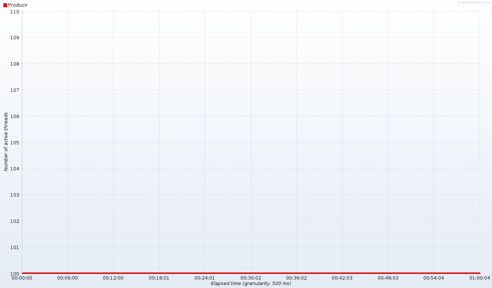
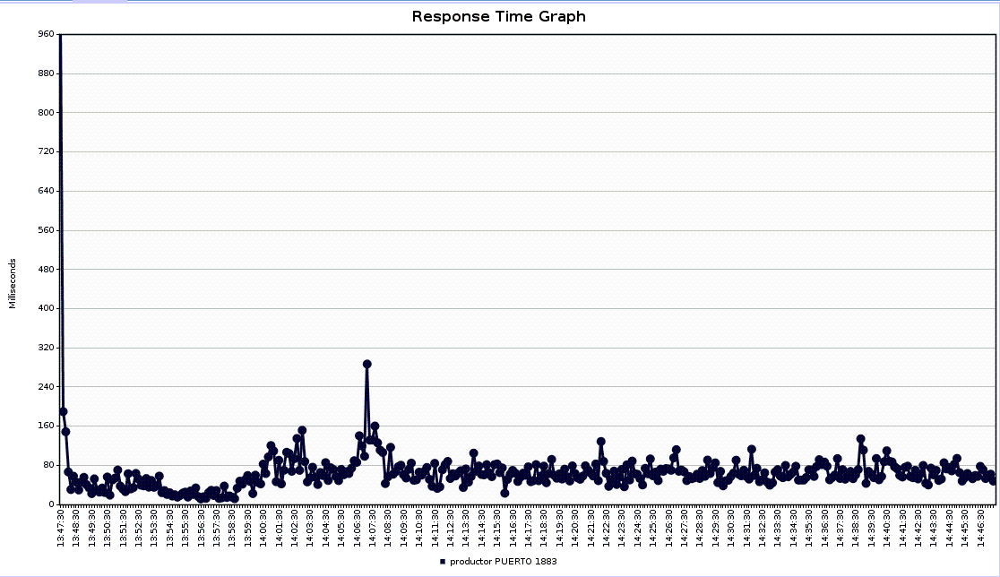

# WorkshopVM

# Tabla de contenido
1. [Objetivo del documento](#1-objetivo-del-documento)
2. [Requisitos hardware](#2-requisitos-hardware)
3. [Requisitos software](#3-requisitos-software)
4. [Ejercicios](#4-ejercicios)

4.1. [Arranque y parada del laboratorio](##4-1-arranque-y-parada-del-laboratorio)

4.2. [Pruebas de mensajería](##4-2-pruebas-de-mensajeria)

4.2.1. [Envío y consumo de mensajes desde un tópico usando los comandos de Apache Kafka](###4-2-1-envío-y-consumo-de-mensajes-desde-un-tópico-usando-los-comandos-de-apache-kafka)

4.2.2. [Réplica de mensajes entre clusters con MirrorMaker](###4-2-2-réplica-de-mensajes-entre-clusters-con-mirrormaker)

4.2.3. [Réplica entre clusters con Enterprise Replicator](###4-2-3-réplica-entre-clusters-con-enterprise-replicator)

4.2.4. [Pruebas de carga con JMeter](###4-2-4-pruebas-de-carga-con-jmeter)

4.2.4.1. [LINEA BASE PRODUCTOR ONLINE](####4-2-4-1-linea-base-productor-online)

4.2.4.2. [LINEA_BASE_PRODUCTOR_BULK_ONLINE](####4-2-4-2-linea-base-productor-bulk-online)
             
4.2.4.3. [LINEA_BASE_PRODUCTOR_BULK_CONNECT](####4-2-4-3-linea-base-productor-bulk-connect)

4.2.4.4. [LINEA_BASE_CONSUMIDOR_ONLINE](####4-2-4-4-linea-base-consumidor-online) 

4.2.4.5. [PRODUCTOR_PICOS](####4-2-4-5-productor-picos)

4.2.4.6. [PRODUCTOR_INCREMENTAL](####4-2-4-6-productor-incremental)

## 1 Objetivo del documento

 Este proyecto es un tutorial para preparar en nuestro portátil o PC un laboratorio de contenedores Docker instanciados
 a partir de imágenes de la última versión de Confluent Kafka, con la siguiente arquitectura:

## 2 Requisitos hardware

 El portátil en el que vamos a instalar el laboratorio debe de tener al menos la siguiente configuración:

   - 16 Gb de RAM
   - 30 GB libres en disco

## 3 Requisitos software

 Para poder seguir los ejercicios de este tutorial necesitaremos disponer de un entorno que permita la virtualización de
 contenedores mediante Docker Compose, así como de los scripts y archivos de configuración contenidos en este proyecto
 de IntelliJ.

 A continuación presentamos tres alternativas para conseguirlo:

 ***Opción 1***

 [Para usuarios de Windows que no quieran instalar Docker en su portátil](./UsarVBoxImage.md),
 pedir al equipo de arquitectura la máquina virtual de VirtualBox llamada "WorkshopVM", arrancarla, abrir una sesión en ella y
 clonar este proyecto de Git desde la misma.

 ***Opción 2***

 [Para usuarios de Windows 7](./InstalarEnWindows7.md), instalar Docker, Docker Compose y VirtualBox, descargar este proyecto en su máquina local y
 seguir los pasos indicados en el resto del documento actual.

 ***Opción 3***

 [Para usuarios de Ubuntu](./InstalarEnUbuntu.md), instalar Docker y Docker Compose y seguir los pasos indicados en el resto del documento
 actual.

## 4 Ejercicios

 La estructura de carpetas de este proyecto es la siguiente:

    ~/ $ tree
    .
    └── WorkshopVM
        ├── docker
        │   ├── linux
        │   │   ├── db2elkmysql.yml
        │   │   ├── docker-compose-generico.yml
        │   │   ├── kafka-connect.yml
        │   │   ├── kafka-rest.yml
        │   │   ├── replicator.yml
        │   │   ├── schema-registry.yml
        │   │   └── zk-kafka.yml
        │   └── windows
        │       ├── docker-compose-1.yml
        │       ├── docker-compose-2.yml
        │       ├── docker-compose-3.yml
        │       ├── docker-compose.yml
        │       ├── inicio.sh
        │       └── parada.sh
        └── scripts
            ├── chaos_monkey.sh
            ├── config
            │   ├── consumerdatacenterb.properties
            │   ├── createDB2sampleDB.sh
            │   ├── db2jcc4.jar
            │   ├── db2jcc.jar
            │   ├── db2jcc_license_cu.jar
            │   ├── LABORATORIO.conf
            │   ├── producerdatacenterb.properties
            │   ├── source-quickstart-db2.properties
            │   └── traefik.toml
            ├── enterprisereplicator.sh
            ├── LABORATORIO.sh
            ├── mirrormaker.sh
            ├── Rest-Proxy-Consumidor.jmx
            ├── Rest-Proxy-Productor.jmx
            └── testJmeter.sh

### 4-1 Arranque y parada del laboratorio

  Hemos proporcionado un script llamado LABORATORIO.sh que utiliza el archivo de configuración LABORATORIO.conf
  para facilitar el arranque y la parada del entorno

  ***Archivo de configuración del laboratorio***

  Está ubicado dentro de la carpeta scripts/conf del laboratorio. Tiene este contenido:

        $ cat config/LABORATORIO.conf

        DOCKER_COMPOSE_ZK_KAFKA          ../docker/linux/zk-kafka.yml
        DOCKER_COMPOSE_SCHEMA_REGISTRY   ../docker/linux/schema-registry.yml
        DOCKER_COMPOSE_KAFKA_CONNECT     ../docker/linux/kafka-connect.yml
        DOCKER_COMPOSE_KAFKA_REST        ../docker/linux/kafka-rest.yml
        DOCKER_COMPOSE_REPLICATOR        ../docker/linux/replicator.yml
        DOCKER_COMPOSE_DB2_ELK_MYSQL     ../docker/linux/db2elkmysql.yml
        INDICE_REPLICACION_DATACENTER    2
        NODOS_REPLICATOR                 1
        CP_VERSION                       latest
        ZOOKEEPER_PORT                   2181
        ZOOKEEPER_INTERNAL_PORT_1        22888
        BROKER_PORT                      9092
        CONNECT_PORT                     8083
        REST_PORT                        8082
        REGISTRY_PORT                    8081
        REPLICATOR_PORT                  8083
        REST_BINDING_PORT                1882
        REGISTRY_BINDING_PORT            1771
        CONNECT_BINDING_PORT             1553
        REPLICATOR_BINDING_PORT          1993
        REINICIAR                        on-failure:1
        RED                              confluent-network

  ***Script de arranque, parada, verificación y borrado del laboratorio***

   Está ubicado dentro de la carpeta scripts/conf del laboratorio. Si lanzamos el script sin parámetros nos indica el modo de uso:

     $ ./LABORATORIO.sh

        Forma de uso:

        ./LABORATORIO.sh iniciar [dc1|todoslosdatacenter] <db2> <elastic> <kibana> <mysql> <oracle>

        ./LABORATORIO.sh verificar

        ./LABORATORIO.sh parar <bd|dc2|todo>

        ./LABORATORIO.sh borrar

         []: indica que es obligatorio elegir. Por ejemplo, "iniciar" requerirá indicar si vamos a iniciar únicamente
         dc1 o si vamos a iniciar todos los datacenter.

         <> indica que es opcional poner o no el valor. Por ejemplo, si sólo queremos arrancar elastic y kibana no
         es necesario pasar el resto de parámetros (db2, mysql, oracle)

          * 'dc1' se refiere a los contenedores del rac principal, excepto los de persistencia de datos.
          * 'todoslosdatacenter' se refiere a todos los datacenter del laboratorio.
          * 'db2' arranca un contenedor de db2.
          * 'elastic' arranca un contenedor de Elasticsearch.
          * 'kibana' arranca un contenedor de Kibana.
          * 'mysql' arranca un contenedor de MySql.
          * 'oracle' arranca un contenedor de Oracle XE.

   Si queremos ***arrancar el laboratorio*** llamaremos al script con el parámetro 'iniciar' seguido de los entornos que necesitamos arrancar.
   Por ejemplo, si queremos arrancar sólo el datacenter principal y la base de datos DB2 ejecutaremos este comando:

        $ ./LABORATORIO.sh iniciar dc1 db2

   Otro ejemplo, para arrancar todos los datacenter y ELK:

        $ ./LABORATORIO.sh iniciar todoslosdatacenter elastic kibana

   ***Para parar las máquinas del laboratorio*** indicaremos que queremos 'parar' en el primer parámetro, y en el segundo
   indicaremos lo que vamo a parar.

   Por ejemplo, si queremos parar el datacenter secundario usaríamos este comando:

     $ ./LABORATORIO.sh parar dc2

   Si queremos parar todos los entornos de persistencia usaremos este comando:

     $ ./LABORATORIO.sh parar bd

   Si queremos parar todo el laboratorio se hace con este comando:

     $ ./LABORATORIO.sh parar todo

   Podemos ***verificar*** en qué estado se encuentra el laboratorio con este comando:

     $ ./LABORATORIO.sh verificar

   Por último, si queremos ***resetear*** el entorno eliminando los archivos temporales, los tópicos y cualquier
   rastro que pueda haber modificado y/o estropeado algún contenedor del laboratorio con este comando:

     $ ./LABORATORIO.sh verificar

### 4-2 Pruebas de mensajería

  Vamos lanzar unas cuantas pruebas de mensajería:

    - Envío y consumo de mensajes desde un tópico usando los comandos de Kafka
    - Réplica entre clusters con MirrorMaker
    - Réplica entre clusters con Enterprise Replicator
    - Pruebas de carga con JMeter

### 4-2-1 Envío y consumo de mensajes desde un tópico usando los comandos de Apache Kafka

 Nuestra primera prueba consiste en asegurarnos mediante los scripts que proporciona Kafka, que los tres broker del cluster
 de nuestro laboratorio trabajan realmente en modo cluster.
 
 Para ello vamos a usar:
   
   - el comando "kafka-topics" para crear un tópico, 
   - el comando "kafka-console-producer" para enviar mensajes al tópico desde uno de los broker, 
   - el comando "kafka-console-consumer" para leer los mensajes de ese tópico desde los tres broker.

 ***Pasos a seguir si estás usando un entorno Linux, ya sea tu PC, o la máquina virtual "WorkshopVM" )***

    1) Abrir cuatro terminales

    2) Desde uno de los terminales, crear un tópico para nuestra prueba

         docker@docker:~$ docker exec -it dc1_kafka-1_1 \
                                    kafka-topics --create \
                                   --zookeeper dc1_zookeeper-1_1:2181,dc1_zookeeper-2_1:2181,dc1_zookeeper-3_1:2181  \
                                   --replication-factor 3 --partitions 2 --topic pruebaencluster

       El comando retorna este resultado:

         Created topic "pruebaencluster".

    3) Con este comando podemos consultar desde otro nodo del cluster de Kafka la información sobre el tópico que hemos creado:

         docker@docker:~$ docker exec -it dc1_kafka-3_1 \
             kafka-topics --describe --topic pruebaencluster \
             --zookeeper dc1_zookeeper-1_1:2181,dc1_zookeeper-1_1:2181,dc1_zookeeper-1_1:2181

       El comando retorna este resultado:

         Topic:pruebaencluster	PartitionCount:2	ReplicationFactor:3	Configs:
         Topic: pruebaencluster	Partition: 0	Leader: 2	Replicas: 2,1,3	Isr: 2,1,3
         Topic: pruebaencluster	Partition: 1	Leader: 3	Replicas: 3,2,1	Isr: 3,2,1

    4) A continuación abrimos un productor desde un terminal:

         docker@docker:~$ docker exec -it dc1_kafka-3_1 \
                     kafka-console-producer \
                    --broker-list dc1_kafka-1_1:9092,dc1_kafka-2_1:9092,dc1_kafka-3_1:9092 \
                    --topic pruebaencluster

       y escribimos unos cuantos mensajes para enviarlos al tópico

         mensaje 1
         mensaje 2
         mensaje 3

    5) Por último, abrimos tres terminales, uno por cada broker de Kafka, y consumimos los mensajes que hemos enviado
    al tópico:

         docker@docker:~$ docker exec -it dc1_kafka-1_1 \
                                kafka-console-consumer \
                                --bootstrap-server dc1_kafka-1_1:9092,dc1_kafka-2_1:9092,dc1_kafka-3_1:9092 \
                                --topic pruebaencluster --from-beginning

         docker@docker:~$ docker exec -it dc1_kafka-2_1 \
                                kafka-console-consumer \
                                --bootstrap-server dc1_kafka-1_1:9092,dc1_kafka-2_1:9092,dc1_kafka-3_1:9092 \
                                --topic pruebaencluster --from-beginning

         docker@docker:~$ docker exec -it dc1_kafka-3_1 \
                                kafka-console-consumer \
                                --bootstrap-server dc1_kafka-1_1:9092,dc1_kafka-2_1:9092,dc1_kafka-3_1:9092 \
                                --topic pruebaencluster --from-beginning

    Los tres consumidores retornan este resultado:

        mensaje 2
        mensaje 1
        mensaje 3
        Processed a total of 3 messages

 ***Pasos a seguir si tienes el laboratorio en Windows con Docker Quickstart. Esta opción NO aplica si usas la máquina virtual "WorkshopVM"***

 Para hacer esta prueba en entornos Windows basta con modificar la lista
 de pasos de Linux, añadiendo estas particularidades:

   - Abrir Powershell en lugar del terminal

   - Cargar las variables de entorno con el comando

        eval $(docker-machine.exe env DCAYDCB)

   - Al invocar los comandos listados, nos referiremos a los contenedores con el prefijo "windows_" en lugar de "linux_"

### 4-2-2 Réplica de mensajes entre clusters con MirrorMaker

 Para llevar a cabo las pruebas de MirrorMaker hemos proporcionado el script mirrormaker.sh, ubicado en la carpeta "scripts"
 del repositorio de Git. Si lo lanzamos sin parámetros podemos ver cómo se usa:
 
      $ ./mirrormaker.sh
    
       Forma de uso:

       Arrancar MirrorMaker desde una ventana con el comando

       $ ./mirrormaker.sh iniciarmirrormaker

       A continuación, abrir otra ventana y producir mensajes en el tópico "topicmirrormakerdcb" del datacenter principal usando el comando

       $ ./mirrormaker.sh producir SinClave <nummensajes>
       o
       $ ./mirrormaker.sh producir ConClave <nummensajes>

       Abrir otra ventana más y consumir los mensajes replicados al tópico "topicmirrormakerdcb" del datacenter secundario usando el comando

       $ ./mirrormaker.sh consumir dc1
       o
       $ ./mirrormaker.sh consumir dc2
 
 ***Verificamos el funcionamiento de MirrorMaker siguiendo estos pasos:***

 1) Asegurate de tener levantados todos los datacenter con este comando:
 
    $ ./LABORATORIO.sh iniciar todoslosdatacenter 
 
 2) Inicia MirrorMaker lanzando el script "mirrormaker.sh" con el parámetro "iniciarmirrormaker":

         docker@docker:~/scripts$ ./mirrormaker.sh iniciarmirrormaker

 2) Iniciar un consumidor de los mensajes que van a ser insertados en el tópico "topicmirrormakerdcb" del dc1 con este comando:

         docker@docker:~/scripts$ ./mirrormaker.sh consumir dc1

    La pantalla queda a la espera de que se produzcan mensajes. Comenzará a imprimirlos cuando lancemos el comando en el paso 4)
    
 3) Iniciar un consumidor de los mensajes que van a ser replicados al tópico "topicmirrormakerdcb" del dc2 con este comando:

         docker@docker:~/scripts$ ./mirrormaker.sh consumir dc2

    La pantalla queda a la espera de que se produzcan mensajes. Comenzará a imprimirlos cuando lancemos el comando en el paso 4)

 4) Abrir otro terminal y producir mensajes en el tópico "topicmirrormakerdcb" del dc1 con este comando:

    Si queremos que los mensajes producidos no tengan clave, usaremos el parámetro SinClave:
    
         docker@docker:~/scripts$ ./mirrormaker.sh producir SinClave <nummensajes>

    Si queremos que los mensajes producidos tengan clave, usaremos el parámetro ConClave:
    
         docker@docker:~/scripts$ ./mirrormaker.sh producir ConClave <nummensajes>

    Una vez el script haya insertado los mensajes en el tópico, comenzaremos a verlos en las ventanas de los comandos consumidores
    que teníamos abiertas en 2) y 3):

         docker@docker:~/scripts$ ./mirrormaker.sh consumir dc1

            CreateTime:1508763949172	9971
            CreateTime:1508763949172	9974
            CreateTime:1508763949173	9977
            CreateTime:1508763949173	9980
            CreateTime:1508763949173	9983
            CreateTime:1508763949173	9986
            CreateTime:1508763949173	9989
            CreateTime:1508763949174	9992
            CreateTime:1508763949174	9995
            CreateTime:1508763949174	9998
            ^CProcessed a total of 10000 messages

         docker@docker:~/scripts$ ./mirrormaker.sh consumir dc2
            CreateTime:1508763949172	9971
            CreateTime:1508763949172	9974
            CreateTime:1508763949173	9977
            CreateTime:1508763949173	9980
            CreateTime:1508763949173	9983
            CreateTime:1508763949173	9986
            CreateTime:1508763949173	9989
            CreateTime:1508763949174	9992
            CreateTime:1508763949174	9995
            CreateTime:1508763949174	9998
            ^CProcessed a total of 10000 messages

### 4-2-3 Réplica entre clusters con Enterprise Replicator

 Para llevar a cabo las pruebas de Enterprise Replicator hemos proporcionado el script enterprisereplicator.sh,
 ubicado en la carpeta "scripts" del repositorio de Git. Si lo lanzamos sin parámetros podemos ver cómo se usa:
 
        $ ./enterprisereplicator.sh***

         Forma de uso:

         $ ./enterprisereplicator.sh iniciarenterprisereplicator
         $ ./enterprisereplicator.sh producir SinClave <nummensajes>
         $ ./enterprisereplicator.sh producir ConClave <nummensajes>
         $ ./enterprisereplicator.sh consumir dc1
         $ ./enterprisereplicator.sh consumir dc2

 ***Verificamos el funcionamiento de Enterprise Replicator siguiendo estos pasos:***

 1) Asegurate de tener levantados todos los datacenter con este comando:
 
        docker@docker:~/scripts$ ./LABORATORIO.sh iniciar todoslosdatacenter 

 2) Iniciar un consumidor de los mensajes que van a ser insertados en el tópico "topicoreplicador" del dc1 con este comando:

         docker@docker:~/scripts$ ./enterprisereplicator.sh consumir dc1

    La pantalla queda a la espera de que se produzcan mensajes. Comenzará a imprimirlos cuando lancemos el comando en el paso 4)

 3) Iniciar un consumidor de los mensajes que van a ser insertados en el tópico "topicoreplicador" del dc2 con este comando:

         docker@docker:~/scripts$ ./enterprisereplicator.sh consumir dc2

    La pantalla queda a la espera de que se produzcan mensajes. Comenzará a imprimirlos cuando lancemos el comando en el paso 4)

 4) Lanzar el script "enterprisereplicator.sh" con los parámetros "producir", "SinClave" o "ConClave" en función de si queremos
 que los mensajes se generen con clave o no, y un número.
 
 Creará un conector de Enerprise Replicator llamado "conector-replicador", y un tópico llamado "topicoreplicador", y a continuación
 insertará en el tópico el número de mensajes indicados en el parámetro correspondiente:

         docker@docker:~/scripts$ ./enterprisereplicator.sh producir SinClave <nummensajes>
 ó 
         docker@docker:~/scripts$ ./enterprisereplicator.sh producir SinClave <nummensajes>
 
 
 Una vez el script haya insertado los mensajes en el tópico, comenzaremos a verlos en las ventanas de los comandos consumidores
 que teníamos abiertas en 2) y 3):

         docker@docker:~/scripts$ ./enterprisereplicator.sh consumir dc1

            CreateTime:1508769524228	19981
            CreateTime:1508769524228	19984
            CreateTime:1508769524228	19987
            CreateTime:1508769524228	19990
            CreateTime:1508769524228	19993
            CreateTime:1508769524228	19996
            CreateTime:1508769524228	19999
            ^CProcessed a total of 6667 messages

         docker@docker:~/scripts$ ./enterprisereplicator.sh consumir dc2

            CreateTime:1508769524228	19981
            CreateTime:1508769524228	19984
            CreateTime:1508769524228	19987
            CreateTime:1508769524228	19990
            CreateTime:1508769524228	19993
            CreateTime:1508769524228	19996
            CreateTime:1508769524228	19999
            ^CProcessed a total of 6667 messages

### 4-2-4 Pruebas de carga con JMeter

 Un requisito indispensable para realizar estas pruebas es necesario tener instalado y configurado JMeter en la máquina que
 vaya a usarse como cliente de pruebas. Para hacerlo hay que seguir estas páginas:

 [Instalar JMeter](https://jmeter.apache.org/)

 [Instalar los plugins de JMeter](https://jmeter-plugins.org/)

 Los plugin se descargan desde esta ubicación:
 
 https://jmeter-plugins.org/downloads/file/JMeterPlugins-Standard-1.4.0.zip
 https://jmeter-plugins.org/downloads/file/JMeterPlugins-ExtrasLibs-1.4.0.zip

 Nuestros JMeter debe tener instalados estos plugin para poder llevar acabo nuestros ejercicios:

 

 Una vez instalado JMeter y configurados los plugin, arrancaremos el entorno. Sólo necesitamos dc1 y db2, por lo que
 usaremos este comando.
 
        docker@docker:~/scripts$ ./LABORATORIO.sh iniciar dc1 db2
 
 Para lanzar el test usaremos el script testJmeter.sh ubicado en la carpeta "scripts" del repositorio de Git. Si lo lanzamos
 sin usar parámetros podemos ver cómo se usa:

       $ ./testJmeter.sh***

        Lanzador de tests de JMeter
        ---------------------------

        Forma de uso:

        testJmeter.sh <TEST_A_LANZAR>

        El parámetro <TEST_A_LANZAR> puede tomar uno de los siguientes valores:

        LINEA_BASE_PRODUCTOR_BULK_ONLINE

        Este test lanzará 1 thread envia de una vez 100 mensajes por segundo, durante 30 minutos.

        LINEA_BASE_PRODUCTOR_ONLINE

        Este test lanzará 100 thread concurrentes, cada uno de ellos envía 1 mensaje por segundo. La duración del test
        será de 30 minutos. Con esta configuración, este test va a enviar 6.000 mensajes por minuto.

        LINEA_BASE_PRODUCTOR_BULK_CONNECT

        Este test lanzará 1 thread por segundo que llamará a un procedure de DB2 que escribirá 100 registros en la
        base de datos de pruebas

        LINEA_BASE_CONSUMIDOR_ONLINE

        Este test lanzará 1 thread por segundo para leer los mensajes que hayan sido escritos en el tópico. El test
        durará 30 minutos.

        PRODUCTOR_PICOS

        Este test inyectará cada 5 minutos 500 threads concurrentes, cada thread escribirá un mensaje. La duración del
        test será de 30 minutos

        PRODUCTOR_INCREMENTAL

        Este test comienza con con 10 threads y cada minuto lanza 10 nuevos threads que se suman a los anteriores

#### 4-2-4-1 LINEA BASE PRODUCTOR ONLINE

 Este test lanzará 100 thread concurrentes, cada uno de ellos envía 1 mensaje por segundo. La duración del test
 será de 30 minutos. Con esta configuración, este test va a enviar 6.000 mensajes por minuto.

 Se inicia con este comando:
 
        docker@docker:~/scripts$ ./testJmeter.sh LINEA_BASE_PRODUCTOR_ONLINE

 Estas son las métricas de la línea base productor online en mi máquina:
 
 ***ActiveThreadsOverTime*** 

 

 ***BytesThroughputOverTime*** 

 

 ***ConnectTimesOverTime*** 

 

 ***HitsperSecond*** 

 

 ***ResponseCodesPerSecond*** 

 

 ***ResponseLatenciesOverTime*** 

 

 ***ResponseTimeGraph*** 

 

 ***ResponseTimesOverTime*** 

 
 
 ***TransactionsPerSecond*** 

 
 
#### 4-2-4-2 LINEA BASE PRODUCTOR BULK ONLINE
             
 Este test lanzará 1 thread envia de una vez 100 mensajes por segundo, durante 30 minutos.

 Se inicia con este comando:
 
        docker@docker:~/scripts$ ./testJmeter.sh LINEA_BASE_PRODUCTOR_ONLINE

 Estas son las métricas de la línea base productor bulk online en mi máquina:
 
 ***ActiveThreadsOverTime*** 

 

 ***BytesThroughputOverTime*** 

 

 ***ConnectTimesOverTime*** 

 

 ***HitsPerSecond*** 

 

 ***ResponseCodesPerSecond*** 

 

 ***ResponseLatenciesOverTime*** 

 

 ***ResponseTimeGraph*** 

 

 ***ResponseTimesOverTime*** 

 
 
 ***TransactionsPerSecond*** 

 

#### 4-2-4-3 LINEA BASE PRODUCTOR BULK CONNECT

 Este test lanzará 1 thread por segundo que llamará a un procedure de DB2 que escribirá 100 registros en la
 base de datos de pruebas

 Se inicia con este comando:
 
        docker@docker:~/scripts$ ./testJmeter.sh LINEA_BASE_PRODUCTOR_BULK_CONNECT

 Estas son las métricas de la línea base productor bulk connect en mi máquina:
 
 ***ActiveThreadsOverTime*** 

 

 ***BytesThroughputOverTime*** 

 

 ***ConnectTimesOverTime*** 

 

 ***HitsperSecond*** 

 

 ***ResponseCodesPerSecond*** 

 

 ***ResponseLatenciesOverTime*** 

 

 ***ResponseTimeGraph*** 

 

 ***ResponseTimesOverTime*** 

 
 
 ***TransactionsPerSecond*** 

 
 
#### 4-2-4-4 LINEA BASE CONSUMIDOR ONLINE

 Este test lanzará 1 thread por segundo para leer los mensajes que hayan sido escritos en el tópico. El test
 durará 30 minutos.

 Se inicia con este comando:
 
        docker@docker:~/scripts$ ./testJmeter.sh LINEA_BASE_CONSUMIDOR_ONLINE

 Estas son las métricas de la línea base consumidor online en mi máquina:
 
 ***ActiveThreadsOverTime*** 

 

 ***BytesThroughputOverTime*** 

 

 ***ConnectTimesOverTime*** 

 

 ***HitsperSecond*** 

 

 ***ResponseCodesPerSecond*** 

 

 ***ResponseLatenciesOverTime*** 

 

 ***ResponseTimeGraph*** 

 

 ***ResponseTimesOverTime*** 

 
 
 ***TransactionsPerSecond*** 

 

#### 4-2-4-5 PRODUCTOR PICOS

 Este test inyectará cada 5 minutos 500 threads concurrentes, cada thread escribirá un mensaje. La duración del
 test será de 30 minutos

 Se inicia con este comando:
 
        docker@docker:~/scripts$ ./testJmeter.sh PRODUCTOR_PICOS

 Estas son las métricas de productor picos en mi máquina:
 
 ***ActiveThreadsOverTime*** 

 

 ***BytesThroughputOverTime*** 

 

 ***ConnectTimesOverTime*** 

 

 ***HitsperSecond*** 

 

 ***ResponseCodesPerSecond*** 

 

 ***ResponseLatenciesOverTime*** 

 

 ***ResponseTimeGraph*** 

 

 ***ResponseTimesOverTime*** 

 
 
 ***TransactionsPerSecond*** 

 

#### 4-2-4-6 PRODUCTOR INCREMENTAL

 Este test comienza con con 10 threads y cada minuto lanza 10 nuevos threads que se suman a los anteriores

 Se inicia con este comando:
 
        docker@docker:~/scripts$ ./testJmeter.sh PRODUCTOR_INCREMENTAL

 Estas son las métricas de productor incremental en mi máquina:
 
 ***ActiveThreadsOverTime*** 

 

 ***BytesThroughputOverTime*** 

 

 ***ConnectTimesOverTime*** 

 

 ***HitsperSecond*** 

 

 ***ResponseCodesPerSecond*** 

 

 ***ResponseLatenciesOverTime*** 

 

 ***ResponseTimeGraph*** 

 

 ***ResponseTimesOverTime*** 

 
 
 ***TransactionsPerSecond*** 

 

