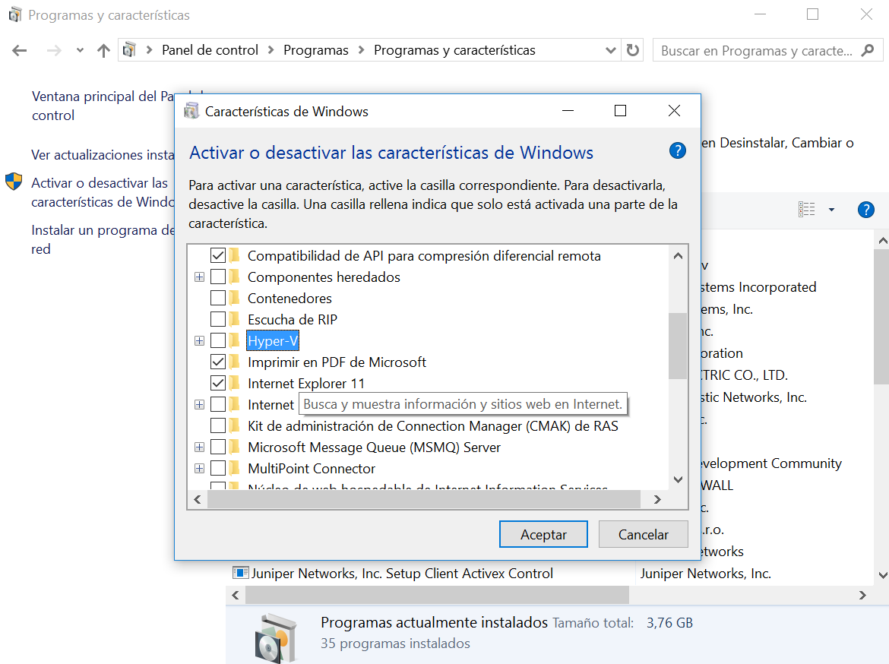
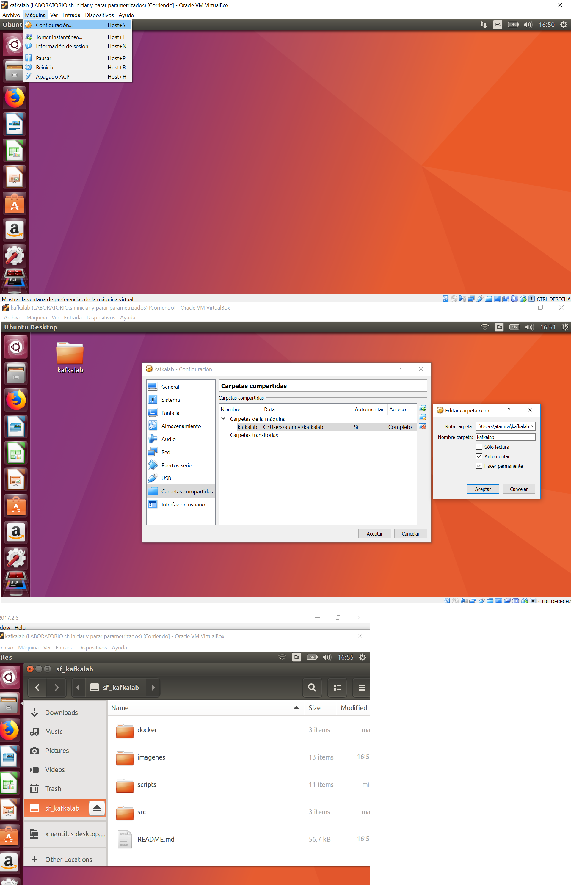

# Pasos para preparar el laboratorio en Windows usando la máquina "Workshop"

 La primera opción que os presentamos es la más sencilla, basta con tener VirtualBox instalado y abrir la máquina "WorkshopVM"
 que os proporcionará el equipo de arquitetura. Veamos en detalle estos pasos:

 - ***Secuencia de comandos para [instalar VirtualBox](http://www.virtualbox.org/) en un portátil con Windows:***

    1) [Descargar el instalador](http://download.virtualbox.org/virtualbox/5.2.0/VirtualBox-5.2.0-118431-Win.exe),
    arrancarlo y seguir los pasos que indica

    2) Descargar el [extension pack](http://download.virtualbox.org/virtualbox/5.2.0/Oracle_VM_VirtualBox_Extension_Pack-5.2.0-118431.vbox-extpack)
    y abrirlo con VirtualBox

    3) Si tenemos Windows 8 o Windows 10, hemos de desactivar Hiper-V:

    

 - ***Pasos para abrir la máquina "Workshop" en VirtualBox:***

   1) Abrir VirtualBox y configurar una unidad de red NAT:

    

   2) Navegar a la carpeta donde está copiada la máquina y abrir el archivo seleccionado en la imagen:

    

   3) La máquina virtual arrancará y se mostrará la ventana para introducir las credenciales de acceso: usuario docker, clave docker.
      Puedes cerrar los comentarios que aparecen:

    

   A partir de ahí puedes acceder al proyecto que te has descargado en tu pc local desde Git y ejecutar los comandos Linux para
   utilizar el laboratorio. Para ello debes de mapear en tu máquina virtual tu unidad de red, como he hecho yo en la mía:

    

 - ***Características de la máquina virtual "Workshop"***

    SI ES NECESARIO PUEDES MODIFICAR LA CONFIGURACIÓN PARA APROVECHAR MEJOR LAS CARACTERÍSTICAS
    FÍSICAS DE TU ENTORNO.

    

 - ***Arranque de entornos Windows con máquina Linux virtual VirtualBox***

  Si tenemos un entorno Windows y no queremos tener instalado Docker podemos usar la imagen Linux de VirtualBox "Workshop",
  preguntar al equipo de arquitectura. Las instrucciones para usar esta imagen están en el apartado ***Pasos para abrir la máquina "Workshop" en VirtualBox:***

  Esta imagen ya está instalada y configurada para utilizar los comandos Linux que se describen en el apartado ***4.1.1) Entornos Linux***
